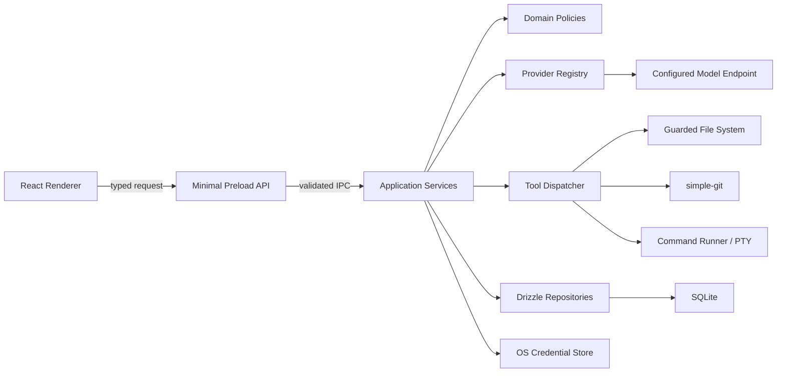
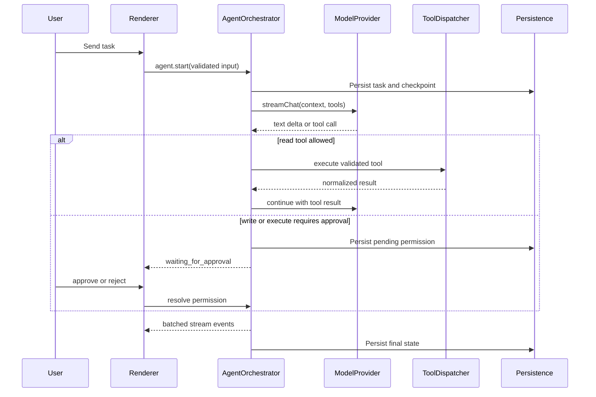

# OpenCode Desk 系统架构

> 状态：阶段 1 架构基线
> 日期：2026-07-28
> 适用范围：MVP 与后续 Provider 扩展
> 本阶段不包含工程初始化或业务实现

## 1. 仓库现状与需求理解

当前工作区 `D:\电脑` 不是 Git 仓库，也没有 OpenCode Desk 的既有工程。工作区中的
`ssh-desktop-client` 是名为 SwiftSSH 的独立 Electron/JavaScript 项目，不适合作为本项目基础。
因此 OpenCode Desk 使用独立目录 `D:\电脑\open-code-desk`，阶段 1 仅创建文档。

OpenCode Desk 是一个本地优先、用户审批驱动的跨平台 AI 编程桌面端。系统必须将模型输出视为
不可信输入，所有文件、终端、Git 和凭据能力只存在于 Electron 主进程，并由类型安全 IPC、
权限策略和审计机制约束。MVP 先跑通一个 OpenAI API 兼容 Provider 的完整闭环，再复用统一
抽象扩展厂商适配器。

### 1.1 MVP 核心闭环

1. 用户打开本地工作区并查看文件树。
2. 用户通过系统凭据库保存 Provider 密钥，通过 SQLite 保存非敏感配置。
3. 用户创建或恢复会话，选择模型并发送任务。
4. Agent 按 Token 预算构建上下文，通过只读工具补充信息。
5. 模型产生文本、结构化工具调用或拟议文件变更。
6. 写入和命令执行先生成审批请求，不直接执行。
7. 用户在 Monaco Diff Editor 中逐文件或整体审批。
8. 主进程通过可回滚事务应用已批准变更。
9. 用户批准测试命令，结果与工具轨迹持久化到会话。

### 1.2 范围边界

MVP 实现 OpenAI Compatible Provider，并为其他厂商保留注册表和独立 Adapter 插槽。首版不以
多 Agent、远程开发、SSH、MCP、向量索引、云同步、团队协作或自动 Git 写操作为验收前置条件。
“支持主流模型”在架构层成立，但只有完成真实适配、错误映射与契约测试的 Provider 才能在 UI
中标记为可用，不能以同一个兼容接口假装原生适配已完成。

## 2. 需求冲突、歧义与裁决

| 议题          | 表面冲突或歧义                                         | 阶段 1 裁决                                                                               |
| ------------- | ------------------------------------------------------ | ----------------------------------------------------------------------------------------- |
| 当前仓库      | 工作区无目标 Git 仓库，已有目录属于其他产品            | 新建独立 `open-code-desk` 目录；阶段 2 再初始化 Git 和 monorepo                           |
| Provider 数量 | 总体要求首版至少 10 个，MVP 又只要求 OpenAI Compatible | MVP 只交付 OpenAI Compatible；其余在阶段 8 逐个达到生产可用                               |
| 文件编辑      | “Monaco 查看和编辑文件”与“修改默认审批”                | 用户手动保存可直接写；AI 产生的变更必须走 FileChange 审批事务                             |
| 停止与取消    | 两者语义重叠                                           | `stop` 中断当前模型/工具步骤并保留可恢复任务；`cancel` 将任务终结为 cancelled             |
| 删除会话      | 历史页要求删除，但审计记录需要保留                     | 默认软删除会话；审计事件按保留策略独立保存，明确清除由用户单独操作                        |
| 自定义请求头  | 可配置 Header，但其中可能包含密钥                      | 敏感 Header 值进入系统凭据库；SQLite 只存名称、类型和引用 ID                              |
| keytar        | 指定 Keychain/Credential Manager 或 keytar             | 通过 `SecretStore` 抽象接入系统凭据库；不得降级为明文文件或 SQLite                        |
| 自动工具循环  | Agent 需要连续工具调用，但写入/执行须审批              | 只读工具可按策略自动执行；写入、执行和危险操作创建可恢复的审批断点                        |
| Linux         | 要预留但首发仅 Windows/macOS                           | Domain/Application 不依赖平台；Infrastructure 使用平台 Adapter，Linux 不作为 MVP 打包门槛 |

## 3. 架构原则

1. **依赖向内**：Presentation 和 Infrastructure 依赖 Application/Domain，Domain 不依赖
   Electron、React、数据库、具体 SDK 或 Node.js。
2. **主进程是能力边界**：文件系统、Git、SQLite、凭据库、网络 Provider、PTY 和进程执行都只在
   主进程中。
3. **默认拒绝**：未知工具、未知 IPC、越界路径、未声明网络端点和未批准副作用全部拒绝。
4. **Provider 可插拔**：业务流程只依赖 `ModelProvider`，厂商差异由 Adapter 和能力描述吸收。
5. **副作用可追踪**：AI 写文件和运行命令必须有 ToolCall、PermissionRequest、审计记录和结果。
6. **变更先暂存后应用**：模型不能直接覆盖文件，FileChange 是所有 AI 写入的唯一入口。
7. **可取消、可恢复**：流、工具和命令接受 `AbortSignal`；任务状态和检查点持久化。
8. **密钥不离开主进程**：渲染进程只知道 `hasSecret` 和凭据引用 ID，永远不读取明文。
9. **能力而非厂商分支**：Agent 按 `ModelCapabilities` 决策，禁止散布厂商 `if/else`。
10. **真实完成定义**：只有通过类型检查、测试和构建的功能才算完成。

## 4. 分层与模块职责

### 4.1 Presentation Layer

- 欢迎页、工作台、Provider 设置、权限设置、历史会话页。
- 文件树、搜索、Monaco Editor/Diff Editor、xterm.js、Git 状态和对话流。
- Zustand 只保存 UI/交互状态和主进程数据快照，不保存 API Key。
- 通过 preload 暴露的最小 API 调用 Application，不访问 Node.js 或数据库。
- 对长列表、日志和文件树采用虚拟化；对流式事件做批量渲染，避免逐 Token 全局更新。

### 4.2 Application Layer

- `ConversationService`：会话、消息、摘要、恢复与导出。
- `AgentOrchestrator`：状态机、模型回合、工具循环、取消、重试和检查点。
- `ContextBuilder`：收集、去重、裁剪、排序和 Token 预算。
- `ToolDispatcher`：Schema 校验、权限决策、执行、审计和结果归一化。
- `PermissionService`：规则匹配、审批生命周期和一次性/持久授权。
- `FileChangeService`：生成 Diff、审批、应用、回滚和历史记录。
- `ProviderService`：Provider 配置、连接测试、模型列表和流式调用。
- `WorkspaceService`：工作区生命周期、最近项目和项目规则发现。
- `CommandService`：命令审批、受控执行、超时、取消和输出持久化。

Application 只依赖端口接口，例如 `WorkspaceFileSystem`、`SecretStore`、`ProviderRegistry`、
`ConversationRepository` 和 `CommandRunner`，由主进程组合根注入实现。

### 4.3 Domain Layer

定义纯 TypeScript 实体、值对象、状态机和错误：

- Provider、模型能力和流事件。
- Workspace、Conversation、ChatMessage、AgentTask。
- ToolCall、ToolResult、PermissionRequest。
- FileChange、FileChangeSet、CommandExecution。
- ContextItem、TokenBudget、AppError。

Domain 不读取环境变量、不访问网络、不调用 Electron，也不包含数据库行类型。

### 4.4 Infrastructure Layer

- Provider Adapter：OpenAI Compatible 及后续厂商协议转换。
- SQLite/Drizzle Repository 与迁移。
- 系统凭据库 Adapter。
- 安全文件系统、路径策略、原子文件写入和回滚快照。
- simple-git、受控子进程/PTY、日志和审计日志。
- Electron BrowserWindow、dialog、IPC、CSP 和生命周期。

## 5. 运行时组件与数据流



### 5.1 流式对话与工具调用



Renderer 订阅基于 `subscriptionId` 的事件流。窗口刷新或重启后，客户端先读取任务快照，再从最后
持久化的序号恢复；网络流本身不承诺跨进程重连，但任务状态不能丢失。

### 5.2 文件变更事务

1. 工具参数、路径和预期基线哈希通过校验。
2. 读取原始内容，生成 `FileChangeSet` 和 unified diff，不写目标文件。
3. 用户可编辑 proposed content，并对单文件或整个集合批准/拒绝。
4. 应用前重新计算目标文件哈希；不一致则标记 `PATCH_CONFLICT`。
5. 在工作区内创建私有临时目录，写入所有拟议内容并 `fsync`。
6. 为受影响文件创建回滚快照，按确定顺序执行同卷原子替换/重命名。
7. 任一步失败则反向恢复；数据库事务记录最终状态和恢复结果。
8. 成功后保留有限数量的回滚快照，并写入审计事件。

文件系统原子性无法覆盖 SQLite 与多个文件为一个真正的 ACID 事务，因此采用 Saga：
“准备快照 → 应用文件 → 提交元数据”，失败时执行补偿回滚。崩溃恢复扫描未完成事务并提示用户。

### 5.3 分层上下文构建

`ContextBuilder` 按以下顺序工作：

1. 收集用户问题、选区、当前文件、手动附件、最近变更、项目摘要、搜索命中、Git Diff、
   规则文件和历史摘要。
2. 使用规范化来源 URI 与内容哈希去重。
3. 将敏感路径策略应用于所有自动发现来源。
4. 估算 Token；Provider 提供 tokenizer 时使用精确实现，否则采用可替换的保守估算器。
5. 预留系统提示、工具定义、模型输出和工具结果预算。
6. 按必要性、用户显式选择、相关性、时效性和大小排序。
7. 对大文件按语义边界截断并明确标注，永不静默截断。
8. 超过预算时先移除低优先级内容，再摘要历史；仍超限则返回 `CONTEXT_TOO_LARGE`。

## 6. 推荐项目目录

```text
open-code-desk/
├─ apps/
│  └─ desktop/
│     ├─ src/
│     │  ├─ main/
│     │  │  ├─ agent/              # Application 组合与 Agent 生命周期
│     │  │  ├─ database/           # SQLite、Drizzle、迁移、Repository
│     │  │  ├─ filesystem/         # 路径策略、安全文件系统、原子写入
│     │  │  ├─ git/                # simple-git Adapter
│     │  │  ├─ ipc/                # 按领域拆分的 IPC handler
│     │  │  ├─ logging/            # 应用日志与审计日志
│     │  │  ├─ providers/
│     │  │  │  ├─ core/            # 仅主进程使用的注册与配置服务
│     │  │  │  ├─ openai-compatible/
│     │  │  │  ├─ openai/
│     │  │  │  ├─ anthropic/
│     │  │  │  ├─ gemini/
│     │  │  │  ├─ openrouter/
│     │  │  │  ├─ deepseek/
│     │  │  │  ├─ qwen/
│     │  │  │  ├─ glm/
│     │  │  │  ├─ moonshot/
│     │  │  │  └─ ollama/
│     │  │  ├─ security/           # SecretStore、脱敏、权限和网络策略
│     │  │  ├─ terminal/           # 命令 Runner 与 PTY
│     │  │  ├─ tools/              # 内置工具实现与注册
│     │  │  ├─ workspace/          # 工作区服务
│     │  │  ├─ composition-root.ts # 唯一依赖装配点
│     │  │  └─ main.ts
│     │  ├─ preload/
│     │  │  ├─ api.ts              # renderer 可见的最小接口
│     │  │  └─ index.ts
│     │  └─ renderer/
│     │     ├─ components/ui/       # shadcn/ui 基础组件
│     │     ├─ features/
│     │     │  ├─ agent/
│     │     │  ├─ chat/
│     │     │  ├─ editor/
│     │     │  ├─ git/
│     │     │  ├─ providers/
│     │     │  ├─ settings/
│     │     │  ├─ terminal/
│     │     │  └─ workspace/
│     │     ├─ hooks/
│     │     ├─ pages/
│     │     ├─ stores/
│     │     ├─ styles/
│     │     └─ types/
│     ├─ electron.vite.config.ts
│     └─ package.json
├─ packages/
│  ├─ domain/                       # 纯实体、值对象、状态机、错误
│  ├─ application/                  # 用例、端口、编排服务
│  ├─ provider-core/                # Provider 契约、注册表、协议无关类型
│  ├─ tool-core/                    # Tool 契约、注册表、Schema 转换
│  ├─ ipc-contracts/                # Channel、Zod Schema、DTO
│  └─ shared/                       # Result、ID、时间、通用工具
├─ tests/
│  ├─ integration/
│  ├─ e2e/
│  └─ fixtures/
├─ docs/
│  ├─ architecture.md
│  ├─ security.md
│  ├─ roadmap.md
│  └─ provider-development.md       # 阶段 9 完善
├─ package.json
├─ pnpm-workspace.yaml
├─ tsconfig.base.json
└─ README.md
```

单元测试与被测模块同目录放置 `*.test.ts(x)`，便于维护；跨模块测试放在 `tests/`。模块通过公开
`index.ts` 暴露稳定 API，不允许跨包导入内部路径。单个业务文件原则上不超过 400 行。

## 7. 核心 TypeScript 接口草案

以下是契约草案，不代表阶段 1 已创建可编译源码。

### 7.1 Provider 契约

```ts
export type ProviderKind =
  | 'openai-compatible'
  | 'openai'
  | 'anthropic'
  | 'gemini'
  | 'openrouter'
  | 'deepseek'
  | 'qwen'
  | 'glm'
  | 'moonshot'
  | 'ollama';

export interface ProviderConfig {
  readonly id: string;
  readonly kind: ProviderKind;
  readonly displayName: string;
  readonly baseUrl: string;
  readonly defaultModel?: string;
  readonly secretRef?: string;
  readonly headers: ReadonlyArray<{
    name: string;
    value?: string;
    secretRef?: string;
  }>;
  readonly options: Readonly<Record<string, string | number | boolean>>;
}

export interface ModelCapabilities {
  readonly streaming: boolean;
  readonly toolCalling: boolean;
  readonly vision: boolean;
  readonly reasoning: boolean;
  readonly structuredOutput: boolean;
  readonly contextWindow?: number;
  readonly maxOutputTokens?: number;
}

export type ChatStreamEvent =
  | { readonly type: 'message_start'; readonly responseId: string }
  | { readonly type: 'text_delta'; readonly delta: string }
  | { readonly type: 'reasoning_delta'; readonly delta: string }
  | { readonly type: 'tool_call_start'; readonly callId: string; readonly name: string }
  | { readonly type: 'tool_call_delta'; readonly callId: string; readonly argumentsDelta: string }
  | { readonly type: 'tool_call_end'; readonly callId: string }
  | { readonly type: 'usage'; readonly inputTokens: number; readonly outputTokens: number }
  | { readonly type: 'message_end'; readonly finishReason: string }
  | { readonly type: 'error'; readonly error: AppError };

export interface ModelProvider {
  readonly id: string;
  readonly name: string;
  readonly kind: ProviderKind;

  validateConfig(config: ProviderConfig, signal?: AbortSignal): Promise<ValidationResult>;
  listModels(config: ProviderConfig, signal?: AbortSignal): Promise<ReadonlyArray<ModelInfo>>;
  streamChat(request: ChatRequest, context: ProviderContext): AsyncIterable<ChatStreamEvent>;
  getCapabilities(model: string): Promise<ModelCapabilities>;
}

export interface ProviderRegistry {
  register(provider: ModelProvider): void;
  get(kind: ProviderKind): ModelProvider;
  list(): ReadonlyArray<ModelProvider>;
}
```

`ProviderContext` 由主进程在最后一刻解析 `secretRef`，并包含 `AbortSignal`、请求 ID、日志脱敏器和
网络策略。它不能被持久化或发往 Renderer。`ProviderConfig` 使用按 Provider Kind 区分的 Zod
discriminated union 进行运行时校验；上方使用统一视图简化文档。

### 7.2 Tool、权限与执行契约

```ts
export type PermissionLevel = 'read' | 'write' | 'execute' | 'dangerous';

export interface ToolExecutionContext {
  readonly workspaceId: string;
  readonly workspaceRoot: string;
  readonly taskId: string;
  readonly callId: string;
  readonly signal: AbortSignal;
  readonly grantedPermissionId?: string;
}

export type ToolResult<TOutput> =
  | { readonly ok: true; readonly value: TOutput; readonly metadata?: ToolResultMetadata }
  | { readonly ok: false; readonly error: AppError; readonly metadata?: ToolResultMetadata };

export interface AgentTool<TInput, TOutput> {
  readonly name: string;
  readonly description: string;
  readonly inputSchema: import('zod').ZodType<TInput>;
  readonly permissionLevel: PermissionLevel;
  execute(input: TInput, context: ToolExecutionContext): Promise<ToolResult<TOutput>>;
}

export interface PermissionRequest {
  readonly id: string;
  readonly taskId: string;
  readonly toolCallId: string;
  readonly level: PermissionLevel;
  readonly summary: string;
  readonly normalizedTarget: string;
  readonly riskReasons: ReadonlyArray<string>;
  readonly inputDigest: string;
  readonly expiresAt: string;
  readonly status: 'pending' | 'approved' | 'rejected' | 'expired' | 'cancelled';
}

export interface PermissionDecision {
  readonly requestId: string;
  readonly decision: 'approve_once' | 'approve_rule' | 'reject';
  readonly expectedInputDigest: string;
}
```

审批绑定规范化参数摘要，防止 UI 展示内容与实际执行内容不一致。未知 Tool 名称、额外参数或过期
审批都必须失败。工具注册表拒绝重复名称。

### 7.3 Agent、上下文与文件变更

```ts
export type AgentStatus =
  | 'idle'
  | 'planning'
  | 'waiting_for_approval'
  | 'executing_tool'
  | 'editing_files'
  | 'running_tests'
  | 'completed'
  | 'failed'
  | 'cancelled';

export interface AgentTask {
  readonly id: string;
  readonly conversationId: string;
  readonly status: AgentStatus;
  readonly attempt: number;
  readonly activeToolCallId?: string;
  readonly checkpoint: AgentCheckpoint;
  readonly createdAt: string;
  readonly updatedAt: string;
}

export interface ContextItem {
  readonly id: string;
  readonly type:
    | 'file'
    | 'selection'
    | 'directory'
    | 'git_diff'
    | 'terminal'
    | 'diagnostic'
    | 'text'
    | 'summary';
  readonly title: string;
  readonly content: string;
  readonly sourceUri?: string;
  readonly contentHash: string;
  readonly tokenEstimate: number;
  readonly priority: number;
  readonly truncated: boolean;
}

export interface FileChange {
  readonly id: string;
  readonly changeSetId: string;
  readonly filePath: string;
  readonly operation: 'create' | 'update' | 'delete' | 'rename';
  readonly previousPath?: string;
  readonly baseContentHash?: string;
  readonly originalContent?: string;
  readonly proposedContent?: string;
  readonly diff: string;
  readonly status: 'pending' | 'approved' | 'rejected' | 'applied' | 'failed' | 'rolled_back';
}

export interface FileChangeService {
  propose(input: ProposeChangesInput): Promise<FileChangeSet>;
  review(input: ReviewChangesInput): Promise<FileChangeSet>;
  apply(changeSetId: string, signal: AbortSignal): Promise<ApplyChangesResult>;
  rollback(changeSetId: string): Promise<RollbackChangesResult>;
}
```

状态流转由 Domain 函数控制。`applied` 只能来自 `approved`，`rejected` 不可应用；内容被用户编辑后
必须重新生成 diff、hash 和审批摘要。

### 7.4 统一错误与 IPC 契约

```ts
export type AppErrorCode =
  | 'PROVIDER_AUTH_FAILED'
  | 'PROVIDER_RATE_LIMITED'
  | 'PROVIDER_UNAVAILABLE'
  | 'MODEL_NOT_FOUND'
  | 'CONTEXT_TOO_LARGE'
  | 'FILE_ACCESS_DENIED'
  | 'WORKSPACE_BOUNDARY_VIOLATION'
  | 'COMMAND_REJECTED'
  | 'COMMAND_FAILED'
  | 'PATCH_CONFLICT'
  | 'DATABASE_ERROR'
  | 'VALIDATION_ERROR'
  | 'CANCELLED'
  | 'UNKNOWN_ERROR';

export interface AppError {
  readonly code: AppErrorCode;
  readonly message: string;
  readonly retryable: boolean;
  readonly details?: Readonly<Record<string, string | number | boolean>>;
  readonly causeId?: string;
}

export type IpcResult<T> =
  { readonly ok: true; readonly data: T } | { readonly ok: false; readonly error: AppError };

export interface DesktopApi {
  readonly workspace: WorkspaceApi;
  readonly files: FilesApi;
  readonly providers: ProvidersApi;
  readonly conversations: ConversationsApi;
  readonly agent: AgentApi;
  readonly permissions: PermissionsApi;
  readonly terminal: TerminalApi;
  readonly git: GitApi;
}
```

每个 IPC 请求和响应在 `packages/ipc-contracts` 中拥有 Zod Schema。IPC 只传 DTO，不传异常对象、
Node 类型、数据库行、函数或 Secret。

## 8. Provider 扩展设计

注册过程为：

1. Adapter 实现 `ModelProvider` 并将厂商事件转换为统一流事件。
2. Adapter 声明配置 Zod Schema、默认端点、能力探测策略与错误映射。
3. 在主进程 composition root 注册。
4. Renderer 依据配置 Schema/metadata 加载独立表单，不修改 Agent。
5. 通过 Provider 契约测试后才出现在正式 Provider 列表。

OpenAI Compatible MVP 支持自定义名称、Base URL、API Key、Model ID、自定义 Header、上下文长度和
能力开关。能力开关是用户声明值，不应被当成服务器保证；连接测试需要验证 `/models`（若支持）和
最小聊天请求，并分别报告认证、模型不存在、协议不兼容和网络错误。流解析器必须支持增量 UTF-8、
跨 chunk SSE 行、`[DONE]`、空 delta、工具参数分片、取消和限流错误。

## 9. 数据库设计

SQLite 文件位于 Electron `userData` 目录，启用外键和 WAL。时间统一存 ISO-8601 UTC，
主键使用 UUID/ULID 文本。JSON 字段在 Repository 边界通过 Zod 校验。API Key 和敏感 Header
明文不进入数据库；`secure_secrets` 只保存 Electron `safeStorage` 使用系统凭据能力生成的密文。

| 表                    | 关键字段                                                                                                                                                                   | 约束与索引                                         |
| --------------------- | -------------------------------------------------------------------------------------------------------------------------------------------------------------------------- | -------------------------------------------------- |
| `workspaces`          | `id`, `canonical_path`, `display_name`, `last_opened_at`, `created_at`, `updated_at`                                                                                       | `canonical_path` 唯一；索引 `last_opened_at`       |
| `conversations`       | `id`, `workspace_id`, `title`, `summary`, `provider_config_id`, `model_id`, `status`, `deleted_at`, timestamps                                                             | FK workspace；索引 workspace+updated；软删除       |
| `messages`            | `id`, `conversation_id`, `role`, `content_json`, `sequence`, `token_estimate`, `created_at`                                                                                | conversation+sequence 唯一；级联删除策略由服务控制 |
| `provider_configs`    | `id`, `kind`, `display_name`, `base_url`, `default_model`, fast/reasoning model, capability flags, Header metadata, `secret_ref`, timestamps                               | 不含明文密钥；`secret_ref` 是不透明引用            |
| `secure_secrets`      | `ref`, `encrypted_value`, timestamps                                                                                                                                       | 仅系统保护密文；主进程可解密                       |
| `model_configs`       | `id`, `provider_config_id`, `model_id`, `display_name`, `capabilities_json`, `context_window`, `is_default`, timestamps                                                    | provider+model 唯一；每类默认模型由事务保证        |
| `agent_tasks`         | `id`, `conversation_id`, `status`, `attempt`, `checkpoint_json`, `error_json`, timestamps, `completed_at`                                                                  | 索引 conversation+created、status                  |
| `tool_calls`          | `id`, `task_id`, `tool_name`, `permission_level`, `input_json`, `input_digest`, `status`, `output_summary_json`, timestamps                                                | 不默认存完整文件内容；索引 task+created            |
| `file_change_sets`    | `id`, `task_id`, `status`, `transaction_id`, `snapshot_path_ref`, timestamps, `applied_at`                                                                                 | 为多文件事务提供聚合根                             |
| `file_changes`        | `id`, `change_set_id`, `file_path`, `previous_path`, `operation`, `base_content_hash`, `original_snapshot_ref`, `proposed_snapshot_ref`, `diff_text`, `status`, timestamps | FK change set；不把大文件正文常驻行内              |
| `command_executions`  | `id`, `task_id`, `tool_call_id`, `executable`, `args_json`, `cwd`, `status`, `exit_code`, `signal`, `started_at`, `ended_at`, `output_ref`                                 | 索引 task+started；敏感 env 不落库                 |
| `permission_requests` | `id`, `task_id`, `tool_call_id`, `level`, `summary`, `target`, `input_digest`, `risk_reasons_json`, `status`, `expires_at`, timestamps                                     | 审批与准确输入绑定                                 |
| `permission_rules`    | `id`, `workspace_id`, `scope`, `action`, `matcher_json`, `enabled`, timestamps                                                                                             | workspace 可空表示全局；危险规则禁止静默持久化     |
| `app_settings`        | `key`, `value_json`, `updated_at`                                                                                                                                          | 只存非敏感设置                                     |
| `audit_events`        | `id`, `workspace_id`, `task_id`, `actor`, `action`, `target`, `result`, `metadata_json`, `created_at`                                                                      | 追加写；索引 created、workspace                    |
| `schema_migrations`   | `id`, `checksum`, `applied_at`                                                                                                                                             | 防止迁移漂移                                       |

### 9.1 消息和大对象存储

`messages.content_json` 保存结构化文本、工具引用和附件引用。文件原文、拟议内容、终端长输出和回滚
快照放在 `userData/artifacts/<workspace-id>/` 的受控目录，以内容哈希命名；数据库只保存引用、大小
和哈希。日志默认不记录这些内容。孤儿 Artifact 由保守的后台清理任务处理，不能删除仍被历史变更
或未完成任务引用的文件。

### 9.2 数据保留

- 会话默认保留，用户删除时软删除；用户可执行明确的永久清除。
- 回滚快照按数量和时间双重限制，清理前检查引用。
- 命令输出设置大小上限并分块持久化。
- 审计日志对删除、命令、越界尝试和密钥操作只记录元数据，不记录密钥或代码正文。

## 10. 内置工具边界

MVP 必须真实实现：`list_directory`、`read_file`、`read_files`、`search_files`、`search_text`、
`create_file`、`update_file`、`delete_file`、`move_file`、`apply_patch`、`get_git_status`、
`get_git_diff`、`run_command`、`run_tests`、`inspect_package`、`get_diagnostics` 中支撑验收闭环的
子集。阶段 5 优先只读工具，阶段 6 统一实现所有 AI 文件写入，阶段 7 实现命令/Git。

工具返回应有大小上限、截断标记和稳定错误码。`search_text` 优先使用受控 `rg` 子进程，找不到时
使用 Node 实现；工具不能通过软链接、junction、绝对路径、`..`、大小写差异或 UNC 路径绕过
工作区边界。

## 11. 关键非功能需求

- **可取消**：Provider、搜索、Git、命令和 Agent 循环传播同一个 `AbortSignal`。
- **背压**：流事件进入有界队列，Renderer 以时间片批量消费。
- **可靠性**：任务每个副作用前后保存检查点；启动时恢复 `planning`、`executing_tool`、
  `editing_files` 等非终态任务。
- **性能**：文件树增量加载；忽略 `.git`、`node_modules` 和可配置大目录；文件读取和搜索限额。
- **可观测性**：请求 ID、任务 ID、工具调用 ID 贯穿日志，但敏感字段统一脱敏。
- **跨平台**：路径比较、命令启动、凭据库、PTY、应用数据目录和打包配置均通过 Adapter。
- **可测试性**：系统时钟、ID、文件系统、SecretStore、Provider 和 CommandRunner 可注入替身。

## 12. MVP 验收清单

以下项目必须基于真实实现和自动/人工验证打勾：

- [ ] Windows 与 macOS 应用可安装、启动、退出和重新打开。
- [ ] `contextIsolation=true`、`nodeIntegration=false`，Renderer 无 Node 能力。
- [ ] 用户可打开本地目录、查看最近项目和文件树。
- [ ] 用户可在 Monaco 查看、编辑并手动保存工作区文件。
- [ ] 路径边界、敏感路径和软链接绕过测试通过。
- [ ] 用户可创建 OpenAI Compatible 配置。
- [ ] API Key 与敏感 Header 只保存在系统凭据库。
- [ ] UI 只能看到密钥是否存在，不回显完整密钥。
- [ ] 可测试连接、拉取模型列表或清楚说明端点不支持。
- [ ] 可选择模型并看到可取消的流式响应。
- [x] 会话、消息、Agent 状态和工具记录可在重启后恢复。
- [x] Agent 可调用经过 Schema 校验的只读文件/搜索工具。
- [x] Agent 不能把普通文本直接当作命令或文件修改执行。
- [x] AI 文件修改先形成 FileChangeSet 和可见 Diff。
- [x] 用户可逐文件/整体批准、拒绝或编辑拟议内容。
- [x] 仅已批准且基线未冲突的修改可原子应用。
- [x] 应用失败可补偿回滚，最近一次成功变更可回滚。
- [ ] 命令显示 executable、args、cwd 和风险后再审批。
- [ ] 批准后的命令可取消、超时并实时显示有界输出。
- [ ] Git Status、Git Diff 和测试结果能进入上下文或会话。
- [ ] Provider、工具、数据库和 IPC 错误映射为可读的 `AppError`。
- [ ] 日志脱敏测试证明 API Key、Authorization 和敏感 Header 不泄漏。
- [ ] `pnpm lint`、`pnpm typecheck`、`pnpm test`、`pnpm build` 全部通过。
- [ ] 关键 E2E 覆盖“配置模型 → 对话 → Diff 审批 → 应用 → 批准测试 → 恢复会话”。

## 13. 主要架构风险

1. **范围风险**：模型、编辑器、Agent、终端、持久化和双平台打包同时进入 MVP，集成面很大。
2. **原生依赖风险**：SQLite、系统凭据库和 PTY 都涉及 Electron ABI 与双平台打包。
3. **Provider 协议漂移**：兼容服务在 SSE、工具调用和错误格式上并不完全兼容。
4. **文件事务风险**：多文件原子写入、Windows 文件锁、崩溃恢复和用户并发编辑较复杂。
5. **命令风险**：命令字符串解析、shell 差异、包管理脚本和子进程树取消存在安全边界。
6. **上下文成本风险**：Token 估算、相关性选择和工具结果膨胀会影响质量与费用。
7. **数据隐私风险**：会话、Diff、终端输出和 Artifact 可能包含源码或秘密，即使 API Key 已安全保存。
8. **Renderer 性能风险**：Monaco、xterm、文件树和高频流并存，需要懒加载和背压。

风险缓解和不可妥协控制见 [security.md](./security.md)，交付顺序与退出条件见
[roadmap.md](./roadmap.md)。
